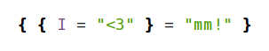
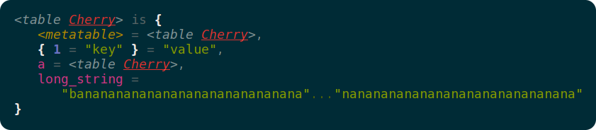

# mm: a delicious Lua inspector



Quickly understand your Lua data in a beautiful, tasty way.



mm writes beautifully indented and color-coded representations of Lua data so 
that you can quickly and clearly understand what's going on. mm doesn't bore 
you with table memory addresses. Instead, mm gives each table a friendly, 
memorable name, so you can instantly make sense of what points where.

## Features

- Human-friendly, color-coded names for cyclical and redundant references.
- Syntax highlighting.
- Indentation and wrapping to fit nicely in a terminal.
- Easily extended to present custom data types.
- 100% delicious.

## mm is not a serializer

There already exist [many][1] [great][2] [serializers][3] for Lua, which do 
amazing jobs of displaying Lua values in nicely-indented Lua syntax while 
handling messy tables, detecting cyclical references, and making you a cup of 
coffee on the side. These tools output Lua syntax, so you can stick the result 
back into a Lua interpreter and produce the same value.

That's not what mm does. The goal of mm is to produce comfortable, 
easily-understood, human-friendly output. By parting with the Lua syntax, mm 
can output values in a much friendlier way. That's why it's an inspector, not a 
serializer.

[1]: http://notebook.kulchenko.com/programming/serpent-lua-serializer-pretty-printer
[2]: https://github.com/gvx/Ser
[3]: http://lua-users.org/wiki/TableSerialization

## Install mm

To install with LuaRocks:

```sh
$ sudo luarocks install mm
```

Or just copy and paste the file `mm.min.lua` into your Lua REPL for a quick 
fix.

## How to use mm

mm is easy to use; it's just one function. Simply pass the function any Lua 
value to have it printed.

For a one-line demo:

```lua
require 'mm' (_G)
```

Some other fun things to try:

```lua
mm = require 'mm'

a = { [{ "key" }] = "value" }
a.a = a
a.long_string = "ba" .. string.rep("na", 100)
setmetatable(a, a)
mm(a)

mm(mm)

f = function() end
mm({ f, f, f })
```
